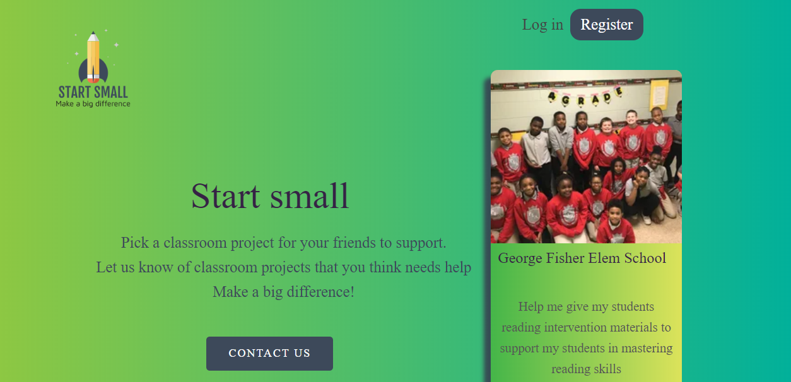
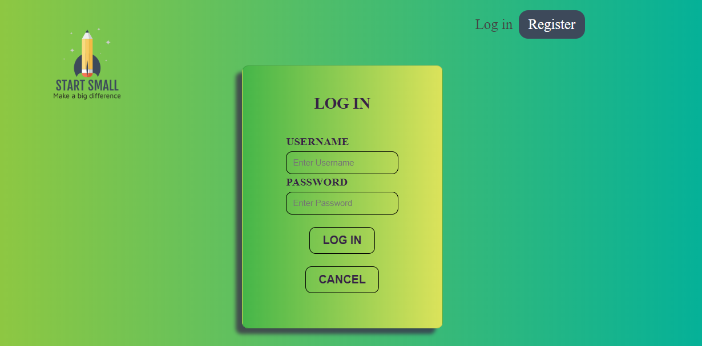
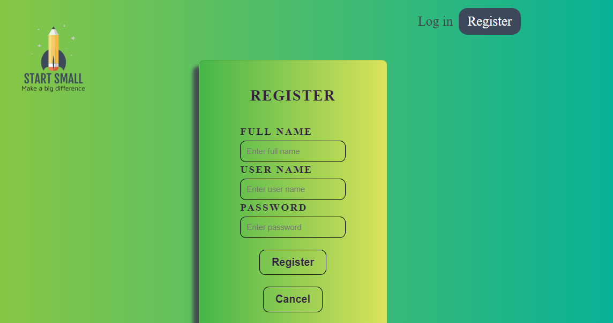
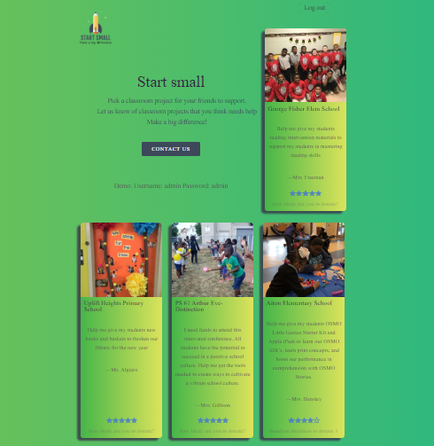
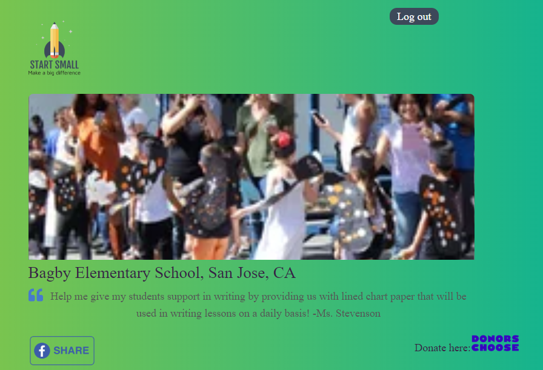
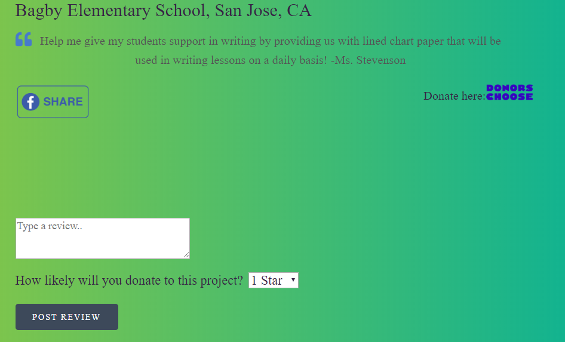

# App name: Start Small

Author: Marie Grace Bodur

Live app: [Start Small](https://start-small.now.sh)

## About Start Small

Start small is an app that provides users with different classroom projects that need funding. It enables users to review a classroom funding project based 1-5 stars 5 as very likely that they will donate to the specific project. It also provides external links to the classroom funding page and a facebook share button.

## Links:

- Github
    [Client](https://github.com/gracebodur/start-small.git)
    [Server](https://github.com/gracebodur/startsmall-api.git)

## Screenshots

#### Landing Page 

 

#### Login Page 

 
#### Registration Page 

#### Project List Page 

#### Project Page 

#### Review and Rating Form 

#### Setting Up

- Install dependencies: `npm install`

#### Scripts

- Start the application for development: `npm start`

##### Technologies used

|||||
|---|---|---|---|
|[JavaScript](https://developer.mozilla.org/en-US/docs/Web/JavaScript)|[HTML5](https://developer.mozilla.org/en-US/docs/Web/Guide/HTML/HTML5)|[CSS3](https://developer.mozilla.org/en-US/docs/Archive/CSS3)|[React](https://reactjs.org/)|

