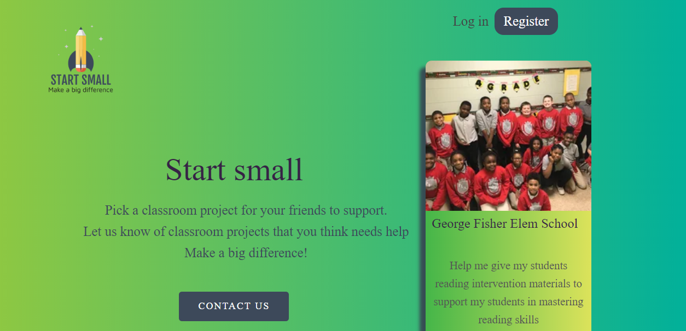
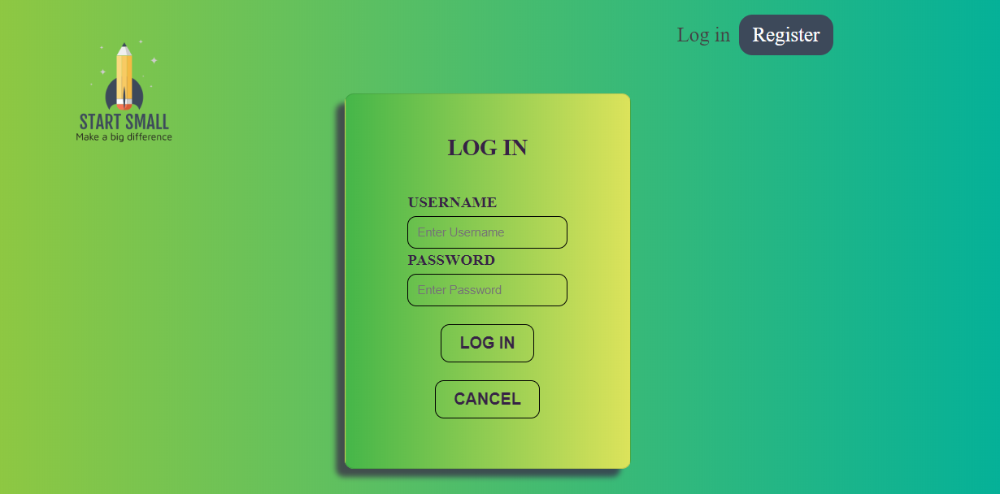
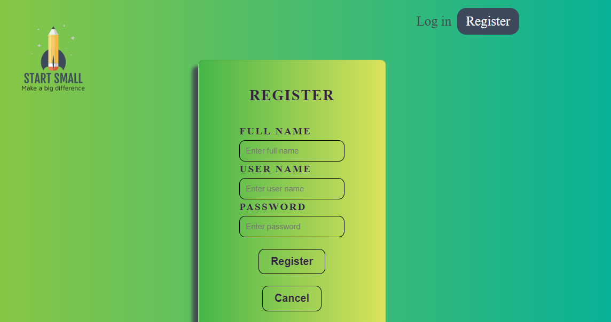
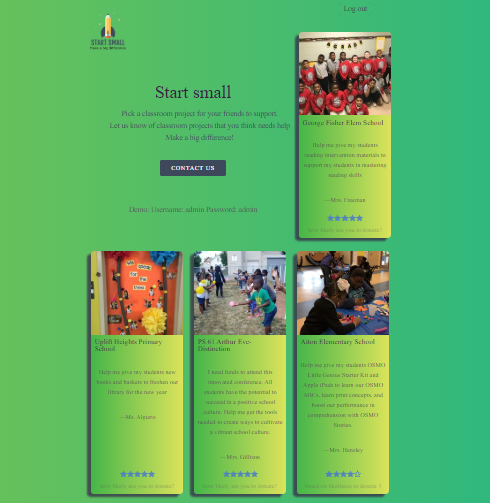
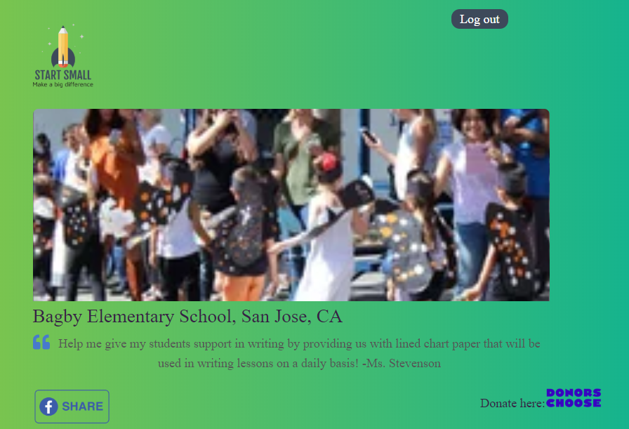
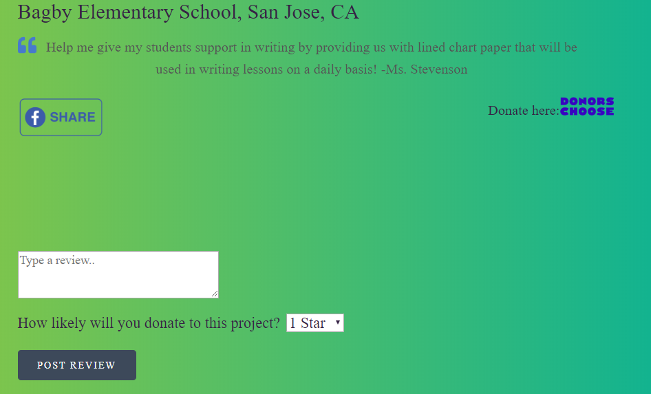

# App name: Start Small

Author: Marie Grace Bodur

Live app: [Start Small]()

## About Start Small

Start small is an app that provides user different classroom projects that needs funding. It enables users to review a classroom funding project based 1-5 stars 5 as very likely that they will donate to the specific project. It also provide external link to the classroom funding page and a facebook share button.

## Technologies used
- Client side: Reactjs, Javascript, HTML and CSS
- Server side: Express.js, Node.js, PostgreSQL

## Links:

- Github
    [Client](https://github.com/gracebodur/start-small.git) |
    [Server](https://github.com/gracebodur/startsmall-api.git)

- Heroku
    [Heroku](https://fierce-earth-14333.herokuapp.com/api)

## Screenshots

Landing Page - located in routes folder. Renders all Project List placed in components folder
 

Login Page - located in routes folder. Renders Login Form placed in components folder

 
Registration Page - located in routes folder. Renders Registration Form placed in components folder

Project List Page - located in routes folder. Renders Project List Items with details of each classroom projects.

Project Page - located in routes folder. Renders individual Project, Reviews, external links, rating and review form.

Review and Rating Form - Rendered by ProjectPage. Review form placed in components folder.

## Setting Up

- Install dependencies: `npm install`

## Scripts

- Start the application for development: `npm start`

